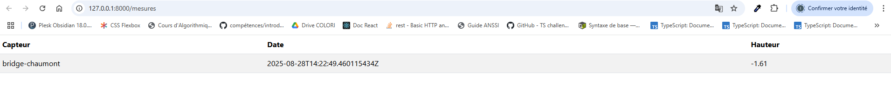

# Application permettant de récupérer les données d'un capteur, de les stocker et de les afficher

## Voici le rendu visuel



## installation
Création de l'environnement virtuel
```bach
py -m venv .venv
```

Activer l'environnement virtuel
```bach
.venv\Scripts\Activate.ps1
```

Installation des librairies
```bach
pip install -r requirements.txt
```

Exécution du serveur
```bach
fastapi dev main.py